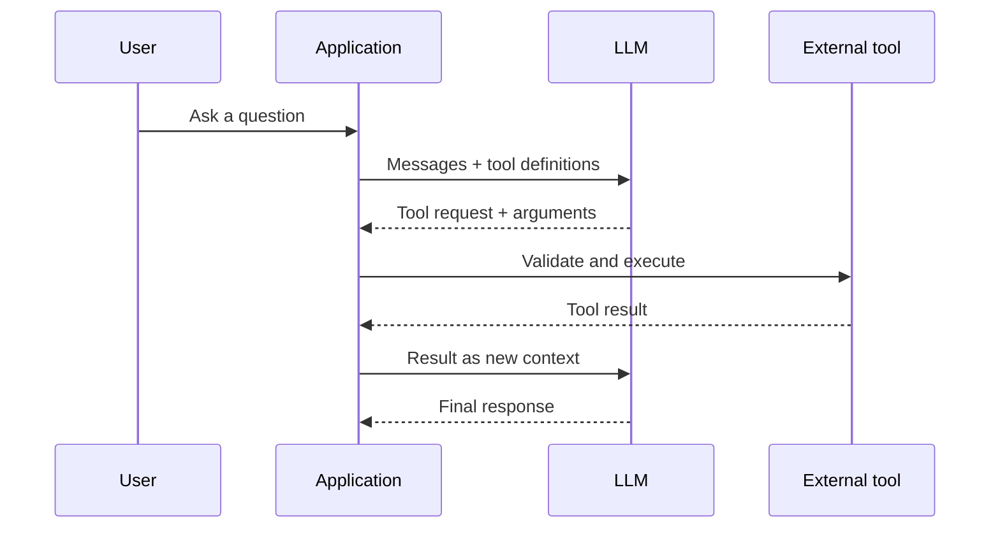

# 1 — Mechanics of One LLM Call

## The complete pipeline

```text
Python application
  → API request
  → messages + parameters
  → chat-template serialization
  → tokenization
  → token IDs
  → embedding vectors
  → Transformer prefill
  → Key–Value (KV) cache
  → next-token probability distribution
  → sampling or constrained decoding
  → one token
  → repeat autoregressively
  → output token IDs
  → detokenization
  → text / JSON / tool call
  → application validation and action
```

The key idea: an LLM does not compose a complete answer and then print it. It repeatedly predicts **one next token at a time**.

## 1. The application constructs a request

Conceptually:

```python
messages = [
    {"role": "system", "content": "You are a helpful assistant."},
    {"role": "user", "content": "What is the capital of France?"},
]

response = client.responses.create(
    model="some-model",
    input=messages,
)
```

The request contains data such as:

- model identifier;
- messages;
- decoding parameters;
- maximum output tokens;
- tool definitions;
- desired response format.

## 2. Messages become one serialized sequence

The model does not literally receive Python dictionaries. A model-specific chat template turns the messages into a sequence resembling:

```text
<system>
You are a helpful assistant.
<user>
What is the capital of France?
<assistant>
```

Role markers are special tokens or patterns learned by the model. Ultimately, the prompt is one ordered token sequence.

## 3. Tokenization converts text to token IDs

Tokens are not always complete words. A tokenizer may split text into words, word pieces, punctuation, or common byte sequences.

```text
"unbelievable" → "un" + "believ" + "able"   # conceptual example
```

Each token maps to an integer ID. The same tokenizer used during training must be used during inference.

## 4. Embeddings convert IDs into vectors

A token ID is only a lookup key. The embedding layer converts it into a dense vector. Positional information lets the model distinguish order.

```text
token identity + position → initial vector representation
```

## 5. Transformer prefill processes the input

During **prefill**, the Transformer processes all input tokens and builds internal representations. Self-attention allows each position to use relevant earlier positions.

The model does not retrieve a stored sentence. Its layers compute a representation from the current token sequence and learned parameters.

## 6. The KV cache avoids repeated work

Attention uses key and value vectors. These are stored in the **Key–Value (KV) cache** for previously processed tokens.

Without the cache, generating every new token would repeatedly recompute the full prefix. With it, decoding reuses prior calculations and processes the newest token.

Important trade-off: a longer active context requires more KV-cache memory.

## 7. The model produces logits and probabilities

For the next position, the model emits one score—called a **logit**—for every token in its vocabulary. Softmax converts logits into a probability distribution.

```text
"Paris"   0.70
"London"  0.15
"Berlin"  0.08
...
```

These are predictions of plausible next tokens, not verified statements of truth.

## 8. A decoder chooses one token

The serving system applies decoding rules such as temperature, top-p sampling, stop conditions, and schema constraints. It then selects one token.

That token is appended to the context, and generation repeats:

```text
current prefix → probabilities → choose token → new prefix
```

This is **autoregressive generation**.

## 9. Output tokens become an application result

The service detokenizes token IDs into text. Depending on the interface and constraints, the result may be:

- natural-language text;
- schema-constrained structured data;
- a request to invoke a tool.

The application must still parse, validate, authorize, execute, retry, log, or reject the result.

## Tool calling is orchestration



The LLM proposes a tool call. The application executes it. A tool-using agent therefore commonly requires multiple LLM calls.

## Check yourself

1. Why does the model not literally receive a list of Python dictionaries?
2. What is the difference between prefill and token-by-token decoding?
3. Why is the KV cache useful, and what resource does it consume?
4. At what layer is an external tool actually executed?
5. Why are next-token probabilities not truth probabilities?

