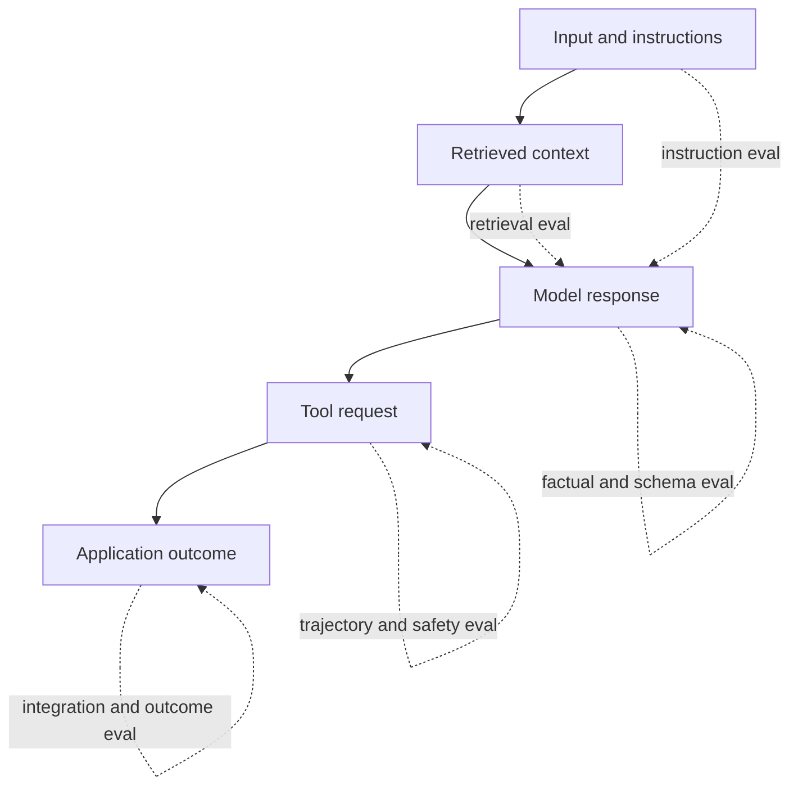

# 3 — Production LLM System Failures

## Taxonomy

```text
LLM SYSTEM FAILURE
├── 1. Instruction failure
├── 2. Context / retrieval failure
├── 3. Reasoning failure
├── 4. Knowledge / grounding failure
├── 5. Hallucination
├── 6. Format / schema failure
├── 7. Tool / action failure
├── 8. Application / integration failure
└── 9. Safety / policy failure
```

Categories can overlap. The debugging goal is to locate the earliest responsible layer instead of labeling every incorrect answer “hallucination.”

## Failure map

| Failure | Diagnostic question | Example | Primary mitigation |
|---|---|---|---|
| Instruction | Did the model ignore a rule it had? | Asked for 3 bullets; returned 5 paragraphs | Clear hierarchy, concise rules, instruction evals |
| Context/retrieval | Did it receive the needed evidence? | RAG retrieves travel policy for a leave-policy question | Retrieval evals, filters, reranking, context inspection |
| Reasoning | Did it misuse available correct information? | Correct prices supplied; total calculated incorrectly | Decomposition, deterministic code, reasoning evals |
| Knowledge/grounding | Was reliable knowledge unavailable or stale? | Gives an outdated chief executive officer | Fresh authoritative data, tools, citations |
| Hallucination | Did it fabricate an unsupported claim? | Invents a policy clause or citation | Grounding, abstention, claim verification |
| Format/schema | Is the shape invalid? | Missing required field or prose around JSON | Schema-constrained output, validation, retry |
| Tool/action | Was the wrong tool/action proposed or executed? | Determines “not eligible” but calls `approve_refund` | Argument validation, authorization, dry runs |
| Application/integration | Did surrounding software mishandle a valid result? | Reads `userId` while model returns `user_id` | Contracts, integration tests, observability |
| Safety/policy | Did the system violate or over-apply a safety rule? | Reveals private data or refuses a benign request | Layered controls, adversarial safety evals |

## Important boundaries

### Instruction vs reasoning

- **Instruction failure:** it did the wrong task or violated an explicit constraint.
- **Reasoning failure:** it attempted the right task but derived the wrong conclusion from available information.

### Knowledge failure vs hallucination

- **Knowledge/grounding failure:** reliable evidence was missing, stale, or unavailable.
- **Hallucination:** the output asserts unsupported content as though it were known.

A missing fact can trigger a hallucination, so both may apply.

### Retrieval vs model failure

If the correct document exists but the retriever does not supply it, the earliest failure is retrieval. Evaluating only the final answer hides the cause.

### Schema vs semantics

```text
valid schema ≠ valid business decision ≠ factual truth
```

Each requires a different validator.

## Debugging order

When a production answer is wrong, inspect the pipeline in causal order:

1. Was the user request interpreted correctly?
2. Were instructions clear, compatible, and present?
3. Were the correct documents and memory retrieved?
4. Did the model reason correctly from that context?
5. Are claims supported by evidence?
6. Does the output satisfy the schema?
7. Was the correct tool called with valid arguments?
8. Did the application parse and execute correctly?
9. Were safety and authorization rules enforced?

## Evaluation alignment



A single final-answer score cannot identify every failure. Production evaluation should cover inputs, retrieval, response, trajectory, tools, and final outcome.

## Check yourself

Classify each failure before reading the answers:

1. The correct policy exists, but the vector search returns an unrelated page.
2. The prompt supplies all numbers, but the model adds them incorrectly.
3. The answer is correct, but the service crashes while parsing it.
4. The output matches the schema but invents a discount rule.
5. The model chooses the correct decision but requests the destructive tool.

Answers: (1) context/retrieval, (2) reasoning, (3) application/integration, (4) hallucination plus grounding failure, (5) tool/action.

