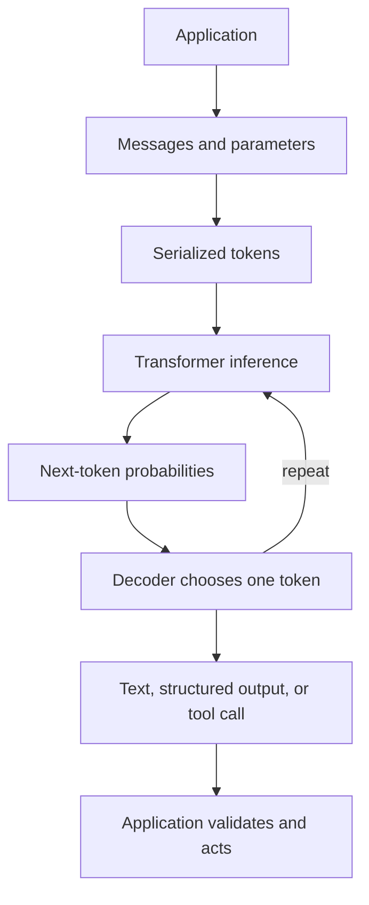

# Day 01 — How One LLM Call Actually Works

This module develops the mental model needed to understand both a single **Large Language Model (LLM)** call and the failure surface of a production LLM application.

## Learning sequence

1. [Mechanics of one LLM call](01-one-llm-call.md)
2. [Six concepts that explain LLM behaviour](02-six-core-questions.md)
3. [Production LLM system failures](03-llm-system-failures.md)
4. [Five-minute revision sheet](04-quick-revision.md)

## Learning objectives

After completing Day 01, you should be able to explain:

- what a Python application sends to an LLM service;
- how messages become a serialized token sequence;
- prefill, decoding, and the **Key–Value (KV) cache**;
- why identical prompts can produce different outputs;
- temperature and context-window behaviour;
- schema-constrained output versus a plain “return JSON” instruction;
- why structurally valid output may still be factually wrong;
- how to classify failures across the complete production pipeline.

## Core mental model

> The model predicts tokens. The surrounding application builds context, validates outputs, executes tools, and decides what happens next.

## Revision method

1. Read the notes in sequence.
2. Answer every **Check yourself** question without looking at the explanation.
3. Use the five-minute sheet on the following day.
4. Explain the end-to-end pipeline aloud in under two minutes.
5. For each production failure, identify the responsible layer and its evaluator.
