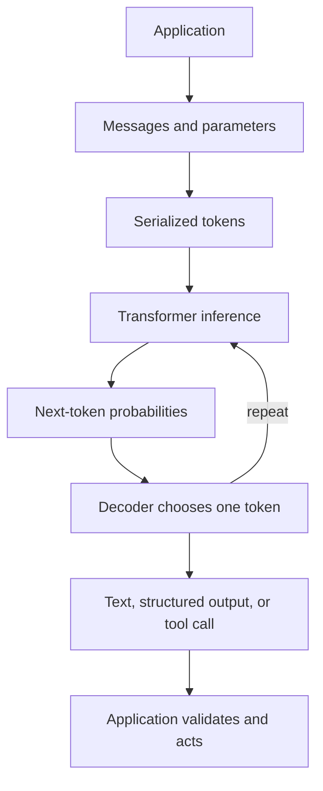

# Day 01 — How One LLM Call Actually Works

This module develops the mental model needed to understand both a single **Large Language Model (LLM)** call and the failure surface of a production LLM application.

## Learning sequence

1. [Mechanics of one LLM call](01-one-llm-call.md)
2. [Six concepts that explain LLM behaviour](02-six-core-questions.md)
3. [Production LLM system failures](03-llm-system-failures.md)
4. [Five-minute revision sheet](04-quick-revision.md)

## Learning objectives

After completing Day 01, you should be able to explain:

- what a Python application sends to an LLM service;
- how messages become a serialized token sequence;
- prefill, decoding, and the **Key–Value (KV) cache**;
- why identical prompts can produce different outputs;
- temperature and context-window behaviour;
- schema-constrained output versus a plain “return JSON” instruction;
- why structurally valid output may still be factually wrong;
- how to classify failures across the complete production pipeline.

## Core mental model



> The model predicts tokens. The surrounding application builds context, validates outputs, executes tools, and decides what happens next.

## Revision method

1. Read the notes in sequence.
2. Answer every **Check yourself** question without looking at the explanation.
3. Use the five-minute sheet on the following day.
4. Explain the end-to-end pipeline aloud in under two minutes.
5. For each production failure, identify the responsible layer and its evaluator.

## Coding exercises: what this Day covers

The scripts in `exercises/` expose the raw official OpenAI Python SDK call.
System messages give application instructions, user messages carry requests, and
assistant messages contain answers (or demonstrate answers in few-shot examples).
Each call supplies its own context; the examples do not share conversation state.
You will explore token sampling and stochasticity, prompt definitions and decision
rules, few-shot prompting, JSON parsing, structured output, Pydantic validation,
and failures across the model and application layers.

## Setup

Run these commands from the repository root with Python 3.10 or newer:

```sh
python -m venv .venv
```

Windows PowerShell:

```powershell
.venv\Scripts\Activate.ps1
```

Windows Command Prompt:

```bat
.venv\Scripts\activate.bat
```

Mac/Linux:

```sh
source .venv/bin/activate
```

Then install the minimal dependencies:

```sh
python -m pip install -r requirements.txt
```

Add your OpenAI API key to the root `.env` file's `OPENAI_API_KEY=` entry.
The file is ignored by Git. `.env.example` is the shareable placeholder.
Never paste a real key into code or documentation. `python-dotenv` loads the root
file regardless of your working directory; an existing shell variable takes precedence.
Missing keys produce a short setup message without calling the API.

`exercises/settings.py` sets `MODEL = "gpt-4.1-mini"`. Change it to a model you
can access if necessary, checking support for Responses, structured output, and
any sampling parameters. These examples use `responses.create` and
`responses.parse(text_format=TravelPlan)`, supported by the installed SDK.
See the official [structured output guide](https://developers.openai.com/api/docs/guides/structured-outputs)
and [model documentation](https://developers.openai.com/api/docs/models/gpt-4.1-mini).

## Running the experiments

Run each independently from the repository root:

```sh
python Day-01/exercises/01-basic-llm-call.py
python Day-01/exercises/02-stochasticity.py
python Day-01/exercises/03-prompt-quality.py
python Day-01/exercises/04a-prompt-only-json.py
python Day-01/exercises/04b-structured-output.py
```

Exercise 5 is a reading exercise: [failure modes](exercises/05-failure-modes.md).
`settings.py` and `travel_schema.py` are support modules, not additional exercises.
API runs require internet access and incur API usage: the defaults make 1, 10,
48, 1, and 1 requests respectively (the SDK may retry transient failures).
The scripts print results to the terminal; exercise 2 also keeps outputs in a list.
Edit `RUNS` and `TEMPERATURE` in exercise 2 to change the experiment.

## What to observe

### 1. Basic LLM call

- Which instructions belong to the system message versus the user message?
- How does the assistant text differ from the full response and token usage?
- What information would you need to send again for a follow-up question?

### 2. Stochasticity

- Why could an ambiguous ticket receive different labels with identical inputs?
- How do counts change when you adjust temperature and repeat the run?
- If all ten outputs match, does that prove future calls will match?

Sampling chooses tokens from a probability distribution. Temperature changes that
distribution; it does not guarantee varied answers or factual accuracy. Even a
zero-temperature run should not be treated as a determinism guarantee.

### 3. Prompt quality

- Did definitions or user/assistant examples change the accuracy?
- Which ambiguous cases depend on the explicit routing policy?
- Did V4 actually improve results, and would that hold on new tickets?
- Did extra prose cause an exact-label mismatch despite a plausible category?

The 12 expected labels follow this exercise's policy. They are not universal
truths. Temperature is held at zero across all versions to reduce sampling noise.
This small teaching set is not evidence that longer prompts always perform better.

### 4. JSON request versus structured output

- Can `json.loads` succeed while Pydantic validation fails?
- What is enforced by a natural-language request versus `text_format`?
- Can a schema-valid itinerary contain invented attractions or impossible timing?
- Which cross-field checks still belong in application code?

Part A may succeed every time you try it; failure is possible, not guaranteed.
Part B constrains output shape and returns a Pydantic object, while still handling
refusals and incomplete output. The basic schema checks fields and types, not
opening hours, prices, or every relationship between fields. Formatting reliability
and factual reliability require different checks.

### 5. Failure modes

- Which layer failed in each example?
- Which problems could application code fix without changing the prompt?
- Which failures remain possible after schema validation?
